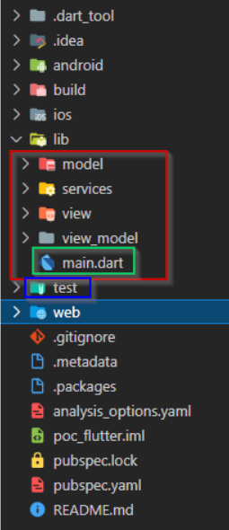

## Sommaire

- [En avant](#getting-started) 
  **1** . [Architecture pour ** Pronochain ** ](#first) 
  **2** . [Commandes pratiques ](#second) 

***

## Getting Started

Pour pouvoir commencer à développer dans les meilleures conditions, plusieurs installations sont nécessaires. Cette documentation est réalisée pour **Windows**,  **Linux** ou tous autre systemes d'exploitation supportant docker. Pour les systemes d'exploitation ne suportant pas docker il vous faudra suivre des tutoriels en ligne.

***

### <a style="font-size: 24px;">**1**</a>. **Architecture** pour **Pronochain**

**Model** :
Le modèle contient les données. Généralement, ces données proviennent d’une base de données ou d’un service externe comme un API.
Ce dossier comprendra un sous dossier **services** pour nos connection à divers apis et services.

**View** : 
La vue correspond à ce qui est affiché. Un ecran de notre application sur mobile dans notre cas.

**Viewmodel** :
Ce composant fait le lien entre le modèle et la vue. Il s’occupe de gérer les liaisons de données.

En bleu ou l’on va coder nos **tests unitaires**.
Et en vert la page principal (**point d’entrée** de **l’application**).

**Services** : 
Le dossier service ne sera pas dans le projet. Il n'est pas nécessaire.

***

### <a style="font-size: 24px;">**2**</a>. Commandes pratiques

flutter create APP_NAME : **Créer** une application.

flutter doctor : Vérifie que tous les **composants** nécessaires au **fonctionnement** de flutter sont **installé** et **fonctionnels**.

flutter pub get : **Récupérer les packages à installer** depuis le **pubspec.yaml**.

flutter pub add le_nom_du_package : **Installer** un **package**.

flutter test : Lance les **tests** de l'application **flutter**.

flutter pub update : **Mets à jou**r** les **packages flutter**.

flutter build : **Build** le projet.

